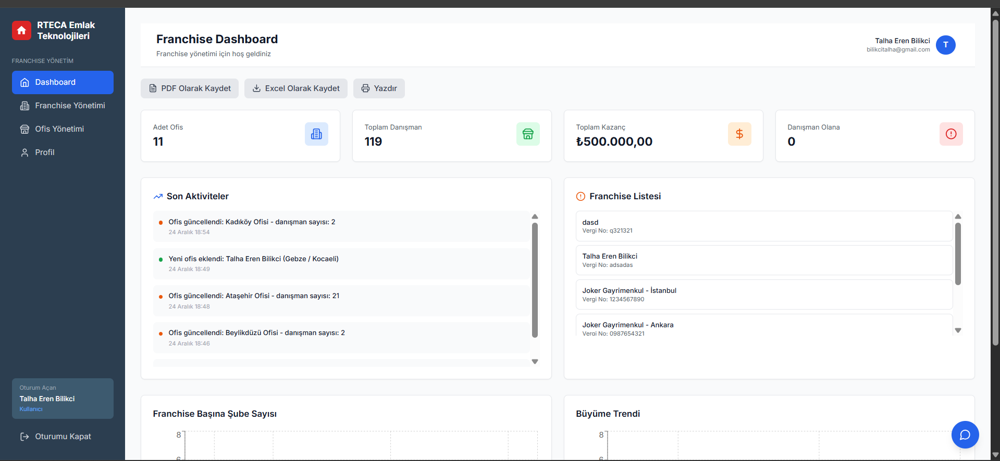
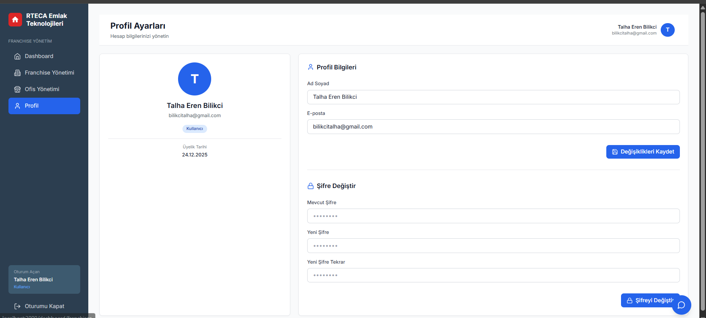

# Emlak Teknolojileri - Franchise Yönetim Sistemi

Full-stack Franchise ve Şube Yönetim Modülü


## 🔧 Kurulum ve Çalıştırma

### Gereksinimler

Projeyi çalıştırmak için aşağıdaki yazılımların sisteminizde yüklü olması gerekmektedir:

- **Docker Desktop** (Windows/Mac için) veya **Docker Engine** (Linux için)
- **Docker Compose** (genellikle Docker ile birlikte gelir)
- **Git** (projeyi klonlamak için)

> 💡 **Not:** Docker kurulu değilse, [Docker Desktop'u indirip kurun](https://www.docker.com/products/docker-desktop/)

### Adım Adım Kurulum

#### 1. Projeyi GitHub'dan İndirin

```bash
# Projeyi klonlayın
git clone https://github.com/talha-eren/RTECA_Emlak_Teknolojileri.git
cd RTECA-Emlak
```

> **Alternatif:** GitHub'dan ZIP olarak indirip açabilirsiniz.

#### 2. Docker'ın Çalıştığını Kontrol Edin

Terminal/PowerShell'de şu komutu çalıştırın:

```bash
docker --version
docker-compose --version
```

Her iki komut da versiyon numarası göstermelidir. Eğer hata alırsanız, Docker'ı başlatın.

#### 3. Projeyi Docker ile Başlatın

Proje dizininde (docker-compose.yml dosyasının bulunduğu yerde) şu komutu çalıştırın:

```bash
# Container'ları build edip başlat (ilk çalıştırmada)
docker-compose up -d --build
```

> ⏱️ **İlk çalıştırmada:** Docker image'ları indirilip build edileceği için 5-10 dakika sürebilir.

#### 4. Container'ların Durumunu Kontrol Edin

```bash
docker-compose ps
```

```

#### 5. Tarayıcıda Açın

Container'lar başladıktan sonra (yaklaşık 30-60 saniye), tarayıcınızda şu adresleri açın:

- **Frontend Uygulaması:** http://localhost:3000
- **Backend API:** http://localhost:8000
- **API Dokümantasyonu (Swagger):** http://localhost:8000/docs

> ⚠️ **Önemli:** İlk açılışta Next.js build işlemi yapılacağı için frontend sayfası birkaç saniye yüklenebilir.

### 🔐 Giriş Bilgileri

**Mock data otomatik olarak yüklenir:**

- **Email:** admin@jokersoft.com
- **Şifre:** admin123

> 📝 **Not:** İlk çalıştırmada backend otomatik olarak veritabanını oluşturur ve örnek verileri yükler.


### ❓ Sorun Giderme

**Port zaten kullanımda hatası:**
- 3000, 8000 veya 5432 portları başka bir uygulama tarafından kullanılıyor olabilir
- `docker-compose.yml` dosyasındaki port numaralarını değiştirebilirsiniz

**Container başlamıyor:**
```bash
# Logları kontrol edin
docker-compose logs

# Container'ları temizleyip yeniden başlatın
docker-compose down
docker-compose up -d --build
```

**Module not found hatası:**
- Frontend container'ını yeniden build edin:
```bash
docker-compose up -d --build frontend
``` 

### Not 
**Resimler net değilse İmages klasoründen detaylı bakabilirsiniz yada projeyi çalıştırarak test edebilirsiniz**

*Dashboard ekranı aşşağıdaki resimdeki gibi görünür.Uygulamamızda yaptığınız tüm değişiklikler buradan takip edebilirsiniz tablo ve grafiklerden yaralanabilirsiniz*
<p align="center">
  
</p>

*Franchise Detayları ekranı aşşağıdaki resimdeki gibi görünür.Bu ekrandan Franchise bilgilerinizi düzenleyebilirsiniz. Ayrıca Pdf ve Excel olarak kayıt edebilirsiniz ve yazdırabilirsiniz*

<p align="center">
  
</p>

*Ofis Yönetimi ekranı aşşağıdaki resimdeki gibi görünür.Bu ekrandan Ofislerinizi görebilirsiniz,ofislerinizi ekleyebilirsiniz ve düzenleyebilirsiniz. Ayrıca Pdf ve Excel olarak kayıt edebilirsiniz ve yazdırabilirsiniz.Sadece herhangi bir ofisinizin bilgilerinide yazdırabilirsiniz*

<p align="center">
  
</p>

*Profil ekranı aşşağıdaki resimdeki gibi görünür.Bu ekrandan Profilinizi görebilirsiniz bilgilerinizi değiştirebilirsiniz.*

<p align="center">
  
</p>

*Giriş ekranı aşşağıdaki resimdeki gibi görünür.Bu ekrandan giriş yapabilirsiniz*
- **Email:** admin@jokersoft.com
- **Şifre:** admin123

<p align="center">
  
</p>

*Kayıt ekranı aşşağıdaki resimdeki gibi görünür.Bu ekrandan kayıt olabilirsiniz.*

<p align="center">
  
</p>

## EK ÖZELLİK
*Yardımcı Asistan aşşağıdaki resimdeki gibi görünür.Bu ekran uygulamaya eklenmiş ek özelliktir. Buradan RTECA Asistanı sizlere yönlendirme yapar*

<p align="center">
  
</p>


## 📊 Mock Data

Sistem ilk çalıştırıldığında otomatik olarak şunları yükler:
- 1 Admin kullanıcı
- 2 Franchise (İstanbul, Ankara)
- 6 Ofis (rastgele danışman sayıları ile)


Projemize giriş yaptıktan sonra 


## 📁 Proje Yapısı

```
RTECA/
├── backend/
│   ├── app/
│   │   ├── routers/         # API endpoints
│   │   ├── models.py        # Database models
│   │   ├── schemas.py       # Pydantic schemas
│   │   ├── auth.py          # JWT authentication
│   │   ├── database.py      # Database connection
│   │   └── main.py          # FastAPI app + Auto-seed
│   ├── scripts/
│   │   └── seed_data.py     # Manual seed script
│   ├── Dockerfile
│   └── requirements.txt
├── frontend/
│   ├── src/
│   │   ├── app/             # Next.js pages
│   │   ├── components/      # React components
│   │   ├── lib/             # API client & utils
│   │   └── types/           # TypeScript types
│   ├── Dockerfile
│   └── package.json
└── docker-compose.yml
```

## 🎯 Kullanım

### Dashboard
- Toplam istatistikler
- Aktivite logları
- Grafikler (Bar & Line charts)
- PDF/Excel export

### Franchise Yönetimi
- Tek franchise bilgisi
- Düzenleme modu
- PDF export

### Ofis Yönetimi
- Ofis listesi (tablo görünümü)
- Danışman sayıları
- CRUD işlemleri
- Her ofis için PDF yazdırma

### Profil
- Kullanıcı bilgileri düzenleme
- Şifre değiştirme
- Aktivite loglarına kaydedilir

### Chatbot
- AI asistan
- Hızlı komutlar
- PDF/Excel oluşturma
- Tam ekran modu

## 📄 Lisans

Bu proje case study amaçlı geliştirilmiştir.

## 👨‍💻 Geliştirici : Talha Eren Bilikci

